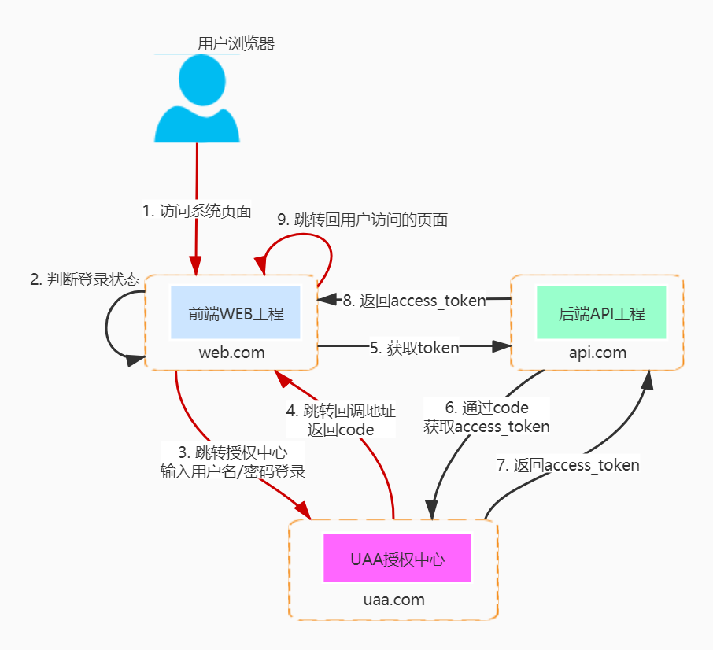

# 基础项目模板

## 项目简介

## 技术架构

项目framework基于jeeplus进行了简化改造，更加便于使用，方便开发。

### 单点登录（前后端分离模式）

前端WEB工程有几个点需要注意：

1. 红色线条为重定向跳转
2. 前端工程可通过是否存在 access_token 判断登录状态
3. 前端工程跳转UAA之前需记录用户访问的页面地址，方便登录完成后重定向回去

RedisStorage key `baseconfig:access_token:{client_id}`

## 参考：
- hutool 简化工具类使用：https://github.com/dromara/hutool
- mybatis-plus 简化Mybatis使用：https://github.com/baomidou/mybatis-plus
- dynamic-datasource-spring-boot-starter 动态数据源：https://gitee.com/baomidou/dynamic-datasource-spring-boot-starter
- retrofit-spring-boot-starter 简化Http接口调用：https://github.com/LianjiaTech/retrofit-spring-boot-starter
    - HTTP客户端，基于Retrofit2 + Okhttp，使用方式类似于 OpenFenign。
